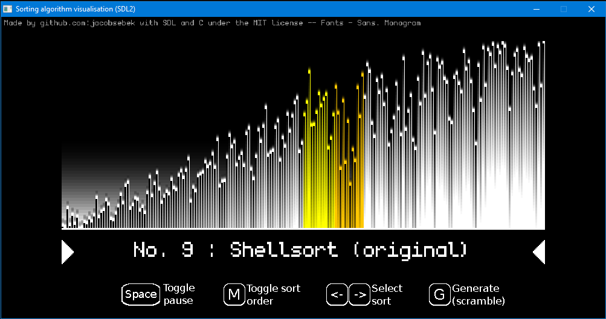

# visual_sort
This is a simple visualisation of common sorting algorithms written in C99 and SDL.  
In fact, it was my very first C project, so that maybe explains some horrendous parts of the code.

## Usage
The use should be pretty intuitive with guides displayed on the screen.  
However, it is also highly customisable using command line arguments, for more info, check [the documentation file](doc/doc.txt)

## Compiling
In order to compile the code, you need to have `SDL2` and `SDL2_image` installed. 
All it takes then is to set the environment variable `SDL_CONFIG` to the path to the `sdl2-config` file (for *nix users, it is defaulted to `/usr/local/bin/sdl2-config`)
and finally `make`.  
The compilation was tested on both Ubuntu and Windows (MinGW64).
